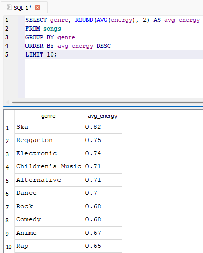

# 🎵 Music Analytics SQL Project

This project explores a large music dataset (232,725 songs, 14,564 unique artists, 27 genres)  
using **SQL queries** to uncover insights about popularity, genres, artists, and song characteristics.

## 📊 Dataset
  **Source:** Spotify-style dataset
- **Total songs:** 232,725  
- **Unique artists:** 14,564  
- **Genres:** 27  
- Includes features such as popularity, energy, danceability, valence, tempo, duration, etc.

## Key Insights
- 🎤 **Most prolific artist**: Giuseppe Verdi (1,394 songs)
- ⭐ **Most popular songs**: Ariana Grande – "7 Rings", Post Malone – "Wow.", Daddy Yankee – "Con Calma"
- ⏱ **Average song length**: 3.92 minutes
- 🎼 **Time signature**: 86% of songs are in 4/4
- ⚡ **Highest energy genre**: Ska (0.82 avg)
- 💃 **Danceability vs Popularity**: Songs average 0.55 danceability and 41 popularity score

### 🎤 Top 10 Artists with Most Songs

### ⭐ Most Popular Songs

### ⏱️ Average Song Length

### 🎶 Average Energy per Genre

## ⚡ Advanced SQL Analysis
- Top 3 most popular songs per genre (Window Functions + CTE)
- Popularity trends per decade
- Correlation between danceability & popularity
- Artists with most #1 genre hits

