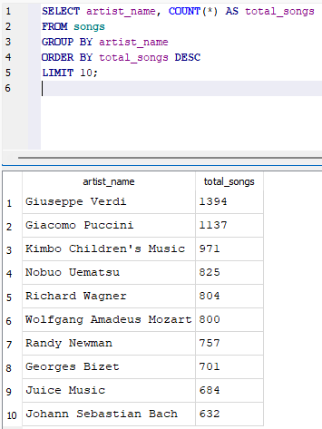
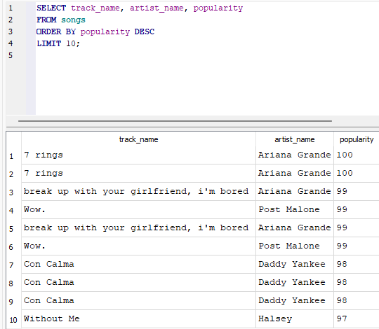
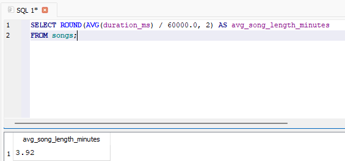

# 🎵 Music Analytics SQL Project

This project explores a large music dataset (232,725 songs, 14,564 unique artists, 27 genres)  
using **SQL queries** to uncover insights about popularity, genres, artists, and song characteristics.

## 📊 Dataset
- **Total songs:** 232,725  
- **Unique artists:** 14,564  
- **Genres:** 27  
- Includes features such as popularity, energy, danceability, valence, tempo, duration, etc.

## 🔎 Example Insights

### 🎤 Top 10 Artists with Most Songs

### ⭐ Most Popular Songs

### ⏱️ Average Song Length

### 🎶 Average Energy per Genre
